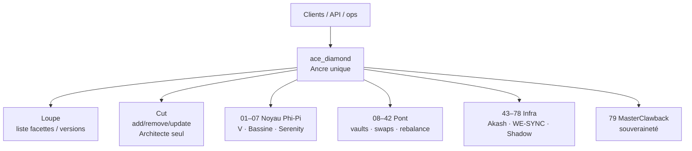

# ACE Diamant — archive claire (SPEC fév. 2026)

**Statut :** 🟡 **PISTE / archive** — mérite relecture sélective · **pas** de relance du dump  
**Sources Bureau (lecture) :** `Desktop/ACE777_CORE.txt` (canon clair) · `ACE777-BOT.txt` · `ACE777_CORE_CURSOR.txt` (chat Cursor ~495 Ko, époque « déconnade ») · `bot_GOLDMAN-BOY/` (mythe ops, **ne pas** coller de clés)  
**Valeur :** A2 (cartographie R&D) · B0–B1 (pas de fills ; idées de modularité utiles)

> **Rappel :** le champion trading actuel (`genesis` md5 `37fca367…`) est **un autre objet**. Le Diamant = vision protocole / modules d’avant. On archive pour **réutiliser les idées**, pas pour mélanger les codebases.

---

## En une phrase

Un **point d’entrée unique** (`ace_diamond`) route vers **79 modules (facettes)** interchangeables — pattern type **EIP-2535 (Diamond)** — avec inspection (Loupe) et taille (Cut) réservés à l’Architecte.

---

## Schéma mental

---

## Invariants (tels que scellés dans la SPEC)

| Élément | Contenu |
|---------|---------|
| Constante α | **V = 1.437** (stockée 1437 / base 1000) |
| Temps | **L_TIME** = floor(unix / 60) — « Lagrange-60 » |
| Supply ACE | **294 000 000** — poches φ (cœur / marché / sentinelle / architecte) |
| Burn | 100 % des ACE rendus à la sortie → restitution capital réel |
| Souveraineté | self-custody 1:1 · Module **79** clawback · « pas de morceaux, pas de bruit » |

### Poches supply (résumé)
- **55.5 %** Cœur souverain (staking 1:1 Top-21 / Or / BTC)  
- **21 %** Résonance marché (liquidité)  
- **14.5 %** Sentinelle (sécurité)  
- **9 %** Conception / Architecte  

### Philosophie « Verre d’eau »
Vide (ACE brûlés) attire · liquide (capital staké) remplit · le capital **garantit**, il ne « cherche » pas le yield · rentabilité via **Calories / Zebec** (flux ops), pas via vente d’ACE.

---

## Architecture Diamant (détail)

| Pièce | Rôle |
|-------|------|
| **ace_diamond** | Route tous les appels ; table de facettes |
| **Loupe** | Inspection : IDs, versions, rôles actifs |
| **Cut** | Add / remove / update facette — on-chain, traçable, Architecte |
| **01–07** | Noyau (Pi-Fib, Phi-Gold, Wyckoff, α 1.437, Hub, ACE) |
| **08–42** | Pont (vaults, BTC/gold, flux, swaps…) |
| **43–78** | Infra (Akash compute, failover 15s, WE-SYNC, Shadow, Observer, SatLink…) |
| **79** | MasterClawback — dernier ressort |

### Programmes cités
`ace_tokenomics` · `ace_oracle` / AceOracle21 · `ace_vault` · `master_clawback` · `ace_strategy` · `ace_liquidity` · services off-chain `ace-core`, `ace-shadow`, `ace-observer`

### Sync / survie
- **WE-SYNC** : nœuds comparent L_TIME, V, Top-21 hash, santé modules  
- **Failover 15 s** : heartbeat perdu → bascule nœuds / SatLink · Module 79 selon gravité  

### Serenity & Trident
- **S-Ratio** ≈ pureté signal vs entropie (cible ~1.437)  
- **Trident** : F_IN (aspiration) · F_OUT (épuration/burn) · S_AXIS (axe souverain)  

---

## Ce que c’était *pas*

- Pas le duo BETA/ALPHA testnet d’aujourd’hui (`GO_USINE_NUAGE`)  
- Pas Hulk MEXC paper  
- Beaucoup de couches **mythe + protocole on-chain** (token ACE, Akash, SatLink) jamais livrées comme produit trading Mac  

`bot_GOLDMAN-BOY` = couche narrative / « exécutrice » de la même période — **archive séparée**, ne pas fusionner avec le champion.

---

## Lien avec le prototype actuel

| Idée Diamant | Équivalent / leçon aujourd’hui |
|--------------|--------------------------------|
| Ancre unique | `GO_USINE_NUAGE.sh` = porte ops (sans toucher genesis) |
| Facettes | Molettes / scripts / Index — **modules hors champion** |
| Loupe | LIVE_COLOR, CSV, `SOUS_L_OEIL`, rapports |
| Cut (Architecte) | **GO humain** + champion intouchable |
| Failover / 79 | STOP, watchdog, hygiene — version sobre |
| 79 modules on-chain | **Trop lourd** pour Mac 8 Go / lab actuel |

Schéma ensemble : [[ARCHITECTURE_AGORA]]

---

## Décision Index (évolutive)

| Verdict | Sens |
|---------|------|
| 🟢 **GARDÉ archive** | Cahier clair · heures de R&D respectées |
| 🔵 **WATCH idées** | Modularité ancre/facettes · Loupe · Cut = GO |
| 🔴 **REFUS relance** | Dump Cursor · 79 programmes · tokenomics 294M · SatLink comme hot path |

Éval : [[Evaluations/18_ace_diamant_archive]]
