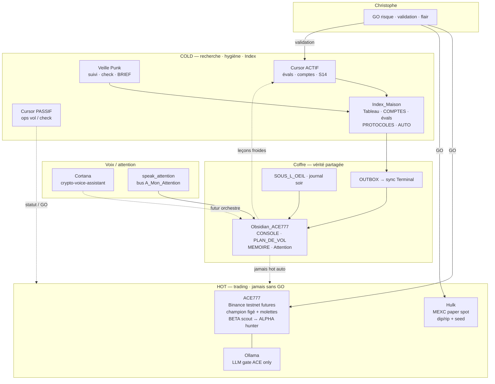

# Architecture — prototype Agora (ensemble)

**Statut :** 🟢 GARDÉ vue d’ensemble · évolutif  
**But :** **un schéma du prototype entier** — jambes + coffre + bus — pour s’orienter, fluidifier, vérifier plans de vol / console.  
**Pas :** un catalogue Ollama Launch (ça = annexe WATCH en bas).  
**Valeur :** A3 · B1

**Vue visuelle (humain) :** `architecture/index.html`  
**Vue TECH (revue IA) :** `architecture/tech.html` · canon [[architecture/ARCHITECTURE_TECH]]  
```bash
open ~/ace777-test-day1/Index_Maison/architecture/index.html
open ~/ace777-test-day1/Index_Maison/architecture/tech.html
```

Réf. audit jambes : `AUDIT_TROIS_JAMBES_SWARM_20260726.md` · [[PHASE_EQUIPE_AGENTS]]

---

## Prototype en une phrase

**Toi** decides (GO) · **ACE + Hulk** tradent (hot, séparés) · **Punk + Cursor** cherchent / écrivent l’Index · **Obsidian** = mémoire & console · **Cortana** = voix / attention (pas encore chef d’orchestre).

---

## Schéma — ensemble



---

## Jambes (ce qui existe)

| Jambe | Rôle | Où | Maturité |
|-------|------|-----|----------|
| **ACE777** | Futures microstructure · duo swarm interne | `ace777-test-day1` · `GO_USINE_NUAGE.sh` | Lab prod · champion sacré |
| **Hulk** | Paper dip/rip MEXC | `hulk-mexc/` | Paper actif |
| **Cortana** | Voix / marché | `crypto-voice-assistant-core` | App OK · **pas** encore chef |
| **Punk** | Veille / sniff intérêts | `veille-punk/` + [[BRIEF_IA_SNIFF]] | Manuel / semi-auto |
| **Index + Obsidian** | Décisions, console, plans, mémoire | `Index_Maison` → vault | Bus humain |
| **Cursor** | Code + ops + recherche ACTIF/PASSIF | chats | 2 rôles |

**Swarm réel aujourd’hui :** surtout **dans** ACE (BETA↔ALPHA).  
**Swarm entre jambes :** embryo (fichiers Markdown / OUTBOX / Attention) — pas un multiplexeur.

---

## Flux utiles (pas du trading auto)

1. **Vol** → GO → ACE et/ou Hulk → CSV / LIVE → post-mortem Index  
2. **Recherche** → validation → éval + COMPTES + Attention + MEMOIRE → OUTBOX → Obsidian  
3. **Sous l’œil** → pulse / journal → console / plans à jour  
4. **Voix** → Attention → `speak_attention` / Cortana plus tard  

---

## Où regarder (vérité)

| Besoin | Fichier |
|--------|---------|
| Console | [[CONSOLE_GENERALE]] |
| Plans | [[PLAN_DE_VOL]] · [[00_PRET_SUITE]] |
| Intérêts | [[BRIEF_IA_SNIFF]] |
| Machine | [[SOUS_L_OEIL]] |
| Mémoire touches | [[MEMOIRE_COLLAB]] |
| Comptes | [[Suivi_Info/COMPTES]] |
| Automations | [[AUTO_PROCESSUS]] |
| Valeur A·B | [[VALEUR_INFORMATION]] |
| **Archive Diamant (R&D fév.)** | [[ACE_DIAMANT_ARCHIVE]] · #18 |

---

## Annexe — Ollama Launch ×9 (WATCH, pas le centre)

Catalogue local (Claude, ChatGPT, Hermes, OpenClaw…) = **outils cold futurs** pour soulager Cursor / jobs Index.  
**S15** · 1 à la fois · Mac froid · jamais pendant ACE.  
Mot : `GO hermes-1` dans [[00_PRET_SUITE]].
