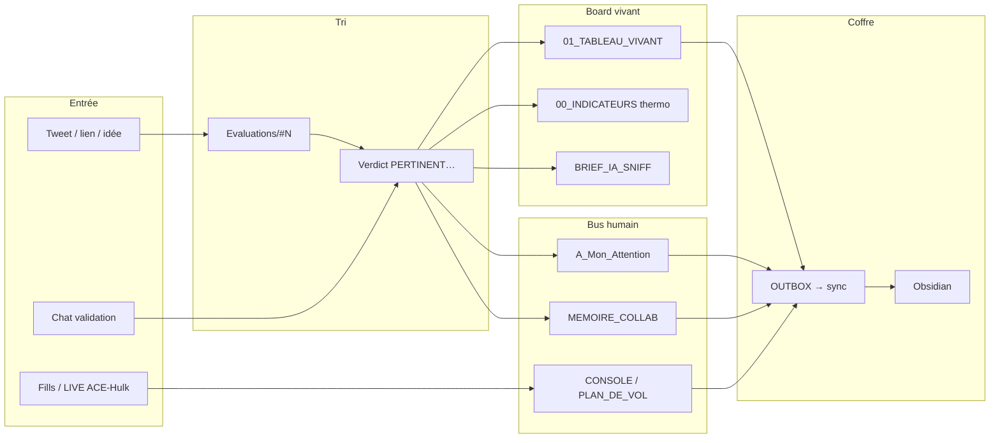

# Ossature Index — anti-éparpillement

**Statut :** 🟢 **loi du coffre** — ouvrir **ici** avant de créer un fichier au hasard  
**But :** chaque info a **une place** ; les places **s’entre-nourrissent** ; plus de dumps Bureau / chats orphelins.  
**Valeur :** A3 · B1

---

## Règle d’or (ne plus répéter l’erreur)

| Interdit | Faire à la place |
|----------|------------------|
| Nouveau `.txt` sur le Bureau « pour plus tard » | Éval `#N` + ligne [[01_TABLEAU_VIVANT]] |
| Recoller une formule / clé / commande dans 4 chats | 1 canon + pointeurs |
| « On classera ce soir » | Checklist ACTIF **même session** |
| Deux vérités (Bureau vs Index) | Index = vérité · Bureau = archive morte ou pointeur |
| **Overdose** (RAG + vault auto + 9 agents) | **1 GO à la fois** · canaliser dans canons existants · fluidité > features |

---

## Carte — où va quoi

---

## Table des places (canon)

| Besoin | **Un seul** fichier canon | Miroir / annexe |
|--------|---------------------------|-----------------|
| Board décisions | [[01_TABLEAU_VIVANT]] | — |
| Thermo A–C | [[00_INDICATEURS_V1]] | [[THERMO_SOURCES_API]] · [[THERMO_DERNIER]] auto free |
| Sniff intérêts | [[BRIEF_IA_SNIFF]] | — |
| Comptes X | [[Suivi_Info/COMPTES]] | Punk `COMPTE_LIENS` |
| À te proposer | `A_Mon_Attention/` | [[ATTENTION_VOCALE]] |
| Qui a touché quoi | [[MEMOIRE_COLLAB]] | Swarm_Bus 09 |
| Machine vivante | [[SOUS_L_OEIL]] | pulse script |
| Automations | [[AUTO_PROCESSUS]] | launchd |
| **Molettes / setups (qui·pourquoi)** | [[JOURNAL_MOLETTES_SETUP]] | E-07 STORM_HUNTER · anti oubli |
| Session recherche | [[PROTOCOLE_SESSION_RECHERCHE]] | règle Cursor |
| Proto ensemble | [[ARCHITECTURE_AGORA]] | `architecture/index.html` (VUE) · `tech.html` + [[architecture/ARCHITECTURE_TECH]] (revue IA) |
| Valeur A·B | [[VALEUR_INFORMATION]] | S14 |
| Formule Bassine | [[FORMULE_BASINE_POINTEUR]] | **pas** en clair |
| Archives R&D | [[ACE_DIAMANT_ARCHIVE]] · [[MEMOIRE_PERSO_SYNTONIE_PERMABEL]] | Bureau = source morte |
| Escalier synaptique | [[HISTO_ESCALIER_SYNAPTIQUE]] | commande fév. — pas relance auto |
| Trinity Abondance Hybride | [[HISTO_TRINITY_ABONDANCE_HYBRIDE]] | Gemini fév. — bassine/rotation · pas tunnel |
| **Cockpit UI** | [[COCKPIT_LOOK_FIGE]] | `cockpit/index.html` · maquette PNG · onglet BOARD |
| **Cockpit horloge / bugs UI** | [[JOURNAL_COCKPIT]] | produit à part · ≠ fills trading |
| **Test avant réel** | [[PROTOCOLE_VALIDATION_TEST_AVANT_REEL]] | [[JOURNAL_ERREURS_TEST]] · #27 |
| Research Desk (backtest) | [[HISTO_RESEARCH_DESK]] | `labo/Backtesting-Engine` · #23 WATCH |
| Local RAG Obsidian | [[HISTO_LOCAL_RAG_OBSIDIAN]] | #24 · après ACE · Origins + plugin léger |
| APIs thermo | [[THERMO_SOURCES_API]] | C23–C25 |
| Commandes Terminal | [[INDEX_COMMANDES]] | — |

---

## Flux d’entre-nourrissement (automatiser *ça*)

| De | Vers | Comment (déjà / à faire) |
|----|------|---------------------------|
| Validation chat | Éval + Tableau + Thermo + Attention + Mémoire + OUTBOX | ✅ règle ACTIF / protocole |
| Journal soir | Console + Journal jour | ✅ launchd 20:53 |
| Pulse | SOUS_L_OEIL | 🟡 brancher launchd 15 min |
| Fills run | Console / post-mortem | 🟡 manuel → script scoreur plus tard |
| Compte validé | COMPTES + Punk | ✅ PREFS |
| OUTBOX | Obsidian | 🟡 `_sync_now.sh` Terminal (TCC) |

**Automatiser = router vers ces cases**, pas inventer 9 agents Launch pendant ACE.

---

## Hygiène anti-dispersion (checklist 30 s)

Avant de **créer** un fichier : existe-t-il déjà une case dans la table ci-dessus ?  
→ Oui = **éditer** le canon.  
→ Non = nouvelle éval `#N` + **1 ligne** tableau + mémoire — puis seulement un nouveau canon si besoin.

---

## Liens démarrage
[[00_LIRE_MOI]] · [[00_PRET_SUITE]] · [[PHASE_EQUIPE_AGENTS]]
