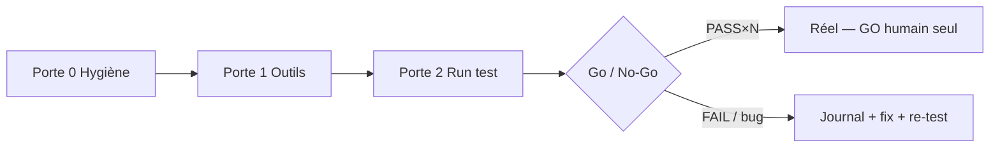

# Protocole — Validation test avant réel

**Statut :** 🟢 GARDÉ · doctrine zone test  
**Valeur :** A3 (économie catastrophe) · B3 ($ / DD réel)  
**Cousins :** [[PROTOCOLE_VALIDATION_PATTERN_V8]] (pattern A vs B) · [[ETAT_VALIDATION_VOIE_A]] · hygiène ACE · [[JOURNAL_ERREURS_TEST]]  
**Inspi métier :** UAT / go-no-go / incident log (severity, prop desk, SRE) — version légère Mac Air.

---

## Avis (pourquoi c’est important)

Oui — **valider en test avant le réel n’est pas optionnel**, c’est la seule barrière honnête entre « ça a l’air bien » et « on perd de l’argent vrai ».

Chez les boîtes sérieuses (trading, SRE, release) on fait toujours :

| Pratique | Chez nous |
|----------|-----------|
| Environnement ≠ prod | testnet / paper · **jamais** live sans GO explicite |
| Critères **écrits avant** le run | grille PASS / FAIL / INCONCLUSIF |
| Go / No-Go humain | Christophe signe · l’IA ne « promeut » pas |
| Journal d’incidents | [[JOURNAL_ERREURS_TEST]] (sévérité + repro + fix) |
| Freeze avant promote | champion `37fca367…` + packs figés |
| Outils vs stratégie séparés | cockpit (lecture) ≠ fills (juge) |

**Réel** ici = argent réel / leviers live.  
**Test** = `GO_USINE_NUAGE` testnet + Hulk paper + cockpit lecture.

---

## 1. Trois portes (dans l’ordre)



### Porte 0 — Machine (hygiène)
- `STERILE=OK` · champion OK · RAM pas critique  
- Chaîne hygiène ACE (protocole run)  
- **Sans ça : pas de run.**

### Porte 1 — Outils (cockpit / thermo / Cortana)
- `cockpit_hygiene_check.sh` → indicateurs OK  
- Pont `:17777` ON si on lit le cockpit  
- BOARD (SIMPLE/COMPLET) charge  
- **Bug outil ≠ échec stratégie** — noter dans [[JOURNAL_COCKPIT]] (horloge UI) et/ou [[JOURNAL_ERREURS_TEST]] si impact juge.

### Porte 2 — Run test (stratégie / duo / Hulk)
- Durée atteinte (pas crash WiFi sans note)  
- CSV α/β + LIVE cohérents  
- Critères du pack (usine / Voie A / autre) **écrits avant**  
- Fin → rapport PnL + 1 ligne journal si anomalie

---

## 2. Grille Go / No-Go (avant de parler « réel »)

Remplir **après ≥ 1 run test propre** (idéalement 2–3 fenêtres).

| # | Condition | PASS si |
|---|-----------|---------|
| G1 | Hygiène stable | STERILE=OK avant **et** après (pas de fantômes) |
| G2 | Données lisibles | CSV + LIVE + cockpit sans mensonge grossier |
| G3 | Pas de P0/P1 ouverts | [[JOURNAL_ERREURS_TEST]] : 0 blocker non corrigé |
| G4 | Objectif test atteint | critères pack (PnL / DD / bruit / skips…) écrits avant |
| G5 | Réalisme frais | lecture S10/S12 — pas « paper = live » |
| G6 | Humain OK | Christophe dit **GO réel** (jamais implicite) |

**No-Go** si un seul P0 ouvert, ou G6 absent, ou run invalide (crash / pack changé en cours).

---

## 3. Sévérité incidents (comme en prod)

| Niveau | Sens | Exemple | Action |
|--------|------|---------|--------|
| **P0** | Bloque le test / risque réel | mauvais levier, GO fantôme, champion touché | STOP immédiat · journal |
| **P1** | Données fausses / juge cassé | PnL cockpit ≠ CSV de façon systématique | pas de conclusion run |
| **P2** | Gêne lecture | pont OFF, LIQ n/d, news trop vite | noter · fix froid |
| **P3** | Cosmétique | glow, wording | backlog |

---

## 4. Cycle d’un run test (checklist courte)

**Avant**
1. Hygiène + `verif_sterilite --pre-run`  
2. `cockpit_hygiene_check` (+ pont si lecture UI)  
3. Écrire : tag · durée · quoi on juge (1 phrase)  
4. GO Christophe → commande dans **son** Terminal  

**Pendant**
- Cockpit = lecture · pas de « petits fix » moteur  
- Anomalie → 1 ligne [[JOURNAL_ERREURS_TEST]] (ne pas improvisier un patch hot)

**Après**
- Stop propre + STATE/PnL si besoin  
- Verdict run : PASS / FAIL / INCONCLUSIF  
- Bugs → journal · décisions → [[MEMOIRE_COLLAB]]  

---

## 5. Ce qu’on ne fait **pas**

- Promouvoir testnet → réel parce que « une session en + »  
- Changer le champion / masses pour « sauver » un test  
- Confondre bug cockpit et edge trading  
- Relancer ACE sans GO parce que le journal est propre  

---

## Commandes

```bash
# Porte 0
cd ~/ace777-test-day1 && ./scripts/verif_sterilite.sh --pre-run

# Porte 1
bash ~/ace777-test-day1/Index_Maison/scripts/cockpit_hygiene_check.sh
python3 ~/ace777-test-day1/Index_Maison/scripts/cortana_cockpit_bridge.py

# Porte 2 — seulement après GO explicite
# ./GO_USINE_NUAGE.sh <durée> <TAG>
```

Journal : [[JOURNAL_ERREURS_TEST]] · Pattern A/B : [[PROTOCOLE_VALIDATION_PATTERN_V8]]
